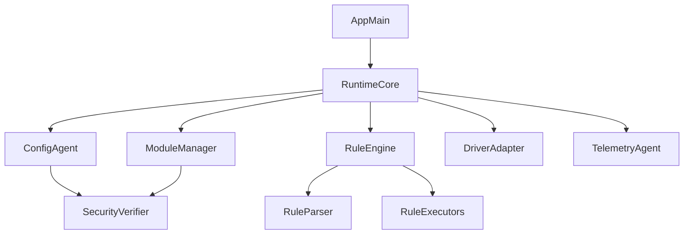
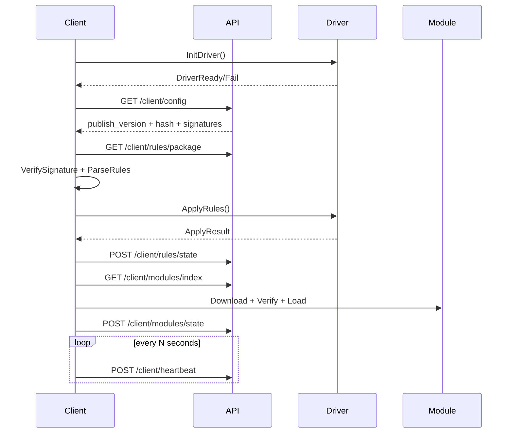

# 04. C++ 客户端分层架构设计

## 1. 设计目标

- 在 Windows 场景稳定运行（网吧无盘/计费软件复杂环境）
- 支持规则拉取、规则应用、模块下载加载、状态上报
- 保证“规则先于模块”生效顺序
- 支持签名校验、失败降级、可观测

## 2. 分层结构

## 3. 核心模块划分

### 3.1 RuntimeCore

- 生命周期管理：`init/start/stop/reload`
- 调度顺序控制：
  1. 驱动初始化
  2. 配置拉取
  3. 规则解析与应用
  4. 模块初始化

### 3.2 ConfigAgent

- 拉取配置：`/client/config`
- 拉取规则包：`/client/rules/package`
- 拉取模块索引：`/client/modules/index`
- 本地缓存：`cache/config`, `cache/rules`, `cache/modules`
- 版本比较：`publish_version`, `rule_hash`

### 3.3 SecurityVerifier

- 验签：规则包、模块包、客户端更新包
- 哈希校验：SHA256 + MD5（兼容）
- 信任根管理：内置公钥 + 热更新公钥列表

### 3.4 RuleEngine

- `RuleParser`：兼容多形态 JSON（对象/字符串化 JSON）
- `RuleNormalizer`：统一成内部 AST
- `RuleDispatcher`：根据类型分发执行器
- `RuleExecutors`：
  - FileRuleExecutor（PE/DIR/MD5）
  - RegRuleExecutor（REG/MD5_REG）
  - NetworkRuleExecutor（IP）
  - WindowRuleExecutor（CtrlWnd）
  - AntiThreadRuleExecutor（AntiThread）
  - ThreadControlExecutor（ThreadControl）

### 3.5 DriverAdapter

- 封装驱动交互接口，避免业务层直接调用
- 能力检测：驱动在线、BFE 状态、权限准备
- 错误映射：驱动错误码 -> 统一客户端错误码
- 降级策略：驱动失败时进入受限模式并上报

### 3.6 ModuleManager

- 模块索引解析与本地版本比对
- 下载、校验、解压、动态加载
- 生命周期：`module_init/module_set_rule/module_free`
- 隔离策略：模块白名单 + 目录隔离 + 超时熔断

### 3.7 TelemetryAgent

- 心跳上报：在线、版本、资源占用
- 规则状态上报：版本、应用结果、失败原因
- 模块状态上报：下载/加载结果
- 事件上报：错误码、崩溃、关键步骤耗时

## 4. 关键时序

## 5. 数据结构建议（客户端内部）

### 5.1 RulePackage

- `publishVersion: string`
- `ruleHash: string`
- `signature: string`
- `rules: vector<RuleItem>`

### 5.2 RuleItem

- `ruleId: uint64`
- `enable: bool`
- `fields: map<string, string>`（存原始 JSON）
- `normalized: RuleAst`（解析后）

### 5.3 ModuleItem

- `moduleId: uint64`
- `name: string`
- `url: string`
- `hash: string`
- `signature: string`
- `entryType: dll|exe`
- `paramJson: string`

## 6. 失败降级策略

- 驱动初始化失败：
  - 标记 `DEGRADED_DRIVER`
  - 仅保留可执行的用户态规则（如部分窗口控制）
  - 高频重试 + 指数退避
- 规则包验签失败：
  - 不应用新规则，回退到最近可用版本
  - 立即上报 `RULE_SIGNATURE_INVALID`
- 模块校验失败：
  - 不加载模块，保留主规则引擎运行
  - 记录事件并告警
- 配置中心不可达：
  - 使用本地缓存继续运行
  - 进入离线保护模式

## 7. 安全要求

- 所有下发包必须验签通过才可执行
- 动态加载模块必须在白名单目录
- 本地缓存加密存储（至少规则包加密）
- 客户端令牌轮换，避免长期有效凭据

## 8. 可测试性设计

- RuleParser 单元测试：覆盖 9 字段 + 多形态 JSON
- DriverAdapter 模拟层：可注入假驱动返回码
- ModuleManager 集成测试：下载/校验/加载失败路径
- E2E：发布版本 -> 客户端拉取 -> 应用 -> 上报闭环
