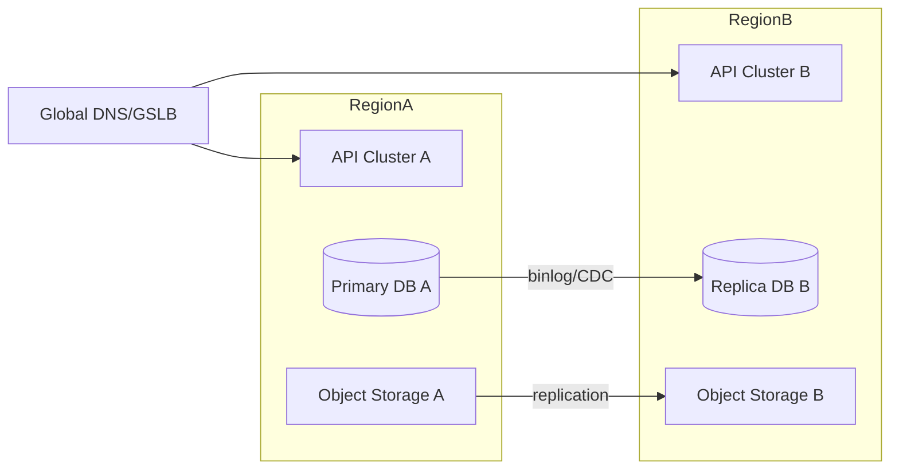

# 05. 签名体系、灰度发布、回滚、多区域高可用与可观测方案

## 1. 签名体系

## 1.1 签名对象

- 规则包（Rule Package）
- 模块包（Module Package）
- 客户端安装包/升级包（Client Package）
- 发布清单（Release Manifest）

## 1.2 密钥体系

- 根公钥：内置客户端，只做验证
- 业务签名私钥：部署在 KMS/HSM，不落盘
- 轮换策略：每 90 天轮换，保留双公钥过渡期

## 1.3 验签流程

1. 拉取对象与元数据（hash、signature、key_id）
2. 校验 hash（SHA256）
3. 按 `key_id` 选择公钥验签
4. 验签通过后才允许落地与加载
5. 验签失败则回退上个可用版本并上报

## 1.4 签名元数据字段

- `artifact_id`
- `artifact_type`
- `artifact_version`
- `hash_sha256`
- `signature`
- `key_id`
- `signed_at`

## 2. 灰度发布

## 2.1 发布粒度

- 按代理灰度
- 按分组灰度
- 按设备灰度
- 全量发布

## 2.2 发布状态机

- `draft` -> `approved` -> `rolling_out` -> `completed`
- 任一阶段可进入 `rollbacking` -> `rolled_back`
- 异常进入 `failed`

## 2.3 灰度策略

- 批次分层：1% -> 10% -> 30% -> 100%
- 每批次观察窗口：5~30 分钟（按网吧规模可调）
- 自动门禁：
  - 规则应用失败率 > 阈值，停止推进
  - 模块加载失败率 > 阈值，停止推进
  - 客户端崩溃率 > 阈值，触发回滚建议

## 3. 回滚机制

## 3.1 回滚对象

- 规则版本回滚（按 publish_version）
- 模块版本回滚（按 module_version）
- 组合回滚（规则+模块）

## 3.2 回滚流程

1. 选择回滚目标（上一个稳定发布）
2. 生成回滚批次（`rollback_of` 指向原批次）
3. 按原范围或指定范围回滚
4. 客户端拉取后切换到旧版本
5. 验证恢复指标并关闭事件

## 3.3 回滚保障

- 所有发布包必须保留至少 30 天
- 发布与回滚都要有完整审计链路
- 回滚过程也需要灰度推进（避免二次事故）

## 4. 多区域高可用架构

## 4.1 一致性策略

- 控制面主写：Region A
- Region B 只读 + 灾备接管
- 发布版本单调递增，客户端按版本比较
- 配置读取可就近，写操作统一走主写区

## 4.2 故障切换

- RPO：<= 1 分钟
- RTO：<= 5 分钟
- 切换步骤：
  1. 冻结写入
  2. 提升 Region B 为主写
  3. 切换 DNS 权重
  4. 恢复写入

## 4.3 客户端容灾

- 维护多个 API/下载域名
- 主域名失败自动回退备用域名
- 离线缓存策略保证短时断联可运行

## 5. 可观测与运维

## 5.1 指标（Metrics）

- 控制面：
  - API QPS、P95/P99、错误率
  - 发布成功率、回滚次数
- 客户端面：
  - 在线数、心跳成功率
  - 规则应用成功率
  - 模块下载/加载成功率
  - 验签失败率

## 5.2 日志（Logs）

- 统一结构化日志：JSON
- 必含：`request_id`, `tenant_id`, `agent_id`, `device_id`, `publish_version`, `error_code`
- 审计日志与业务日志分仓存储

## 5.3 告警（Alerts）

- 规则应用失败率连续 5 分钟超阈值
- 模块加载失败率超阈值
- 发布批次卡死超时
- 跨区域复制延迟超阈值

## 5.4 追踪（Tracing）

- 发布链路全链路追踪：管理端请求 -> 发布服务 -> 客户端拉取 -> 状态上报
- 故障定位时可按 `request_id` 回放

## 6. 安全与合规要求

- RBAC + 最小权限 + 敏感操作二次认证
- 所有发布与回滚操作必须审计
- 制品供应链扫描（SBOM、漏洞扫描、签名）
- 客户端上报数据脱敏（MAC/IP 视情况哈希化）

## 7. 实施里程碑与验收

### 里程碑 A（基础）

- 完成签名验证闭环（规则包）
- 完成灰度发布与手动回滚
- 建立基础监控看板

### 里程碑 B（增强）

- 模块包签名与自动门禁
- 回滚自动化与告警联动
- 区域只读副本上线

### 里程碑 C（生产）

- 区域级演练通过（主备切换）
- SLO 达标（规则应用成功率、发布成功率）
- 安全审计闭环通过
